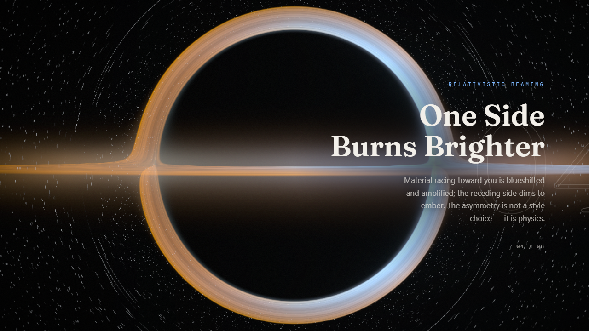
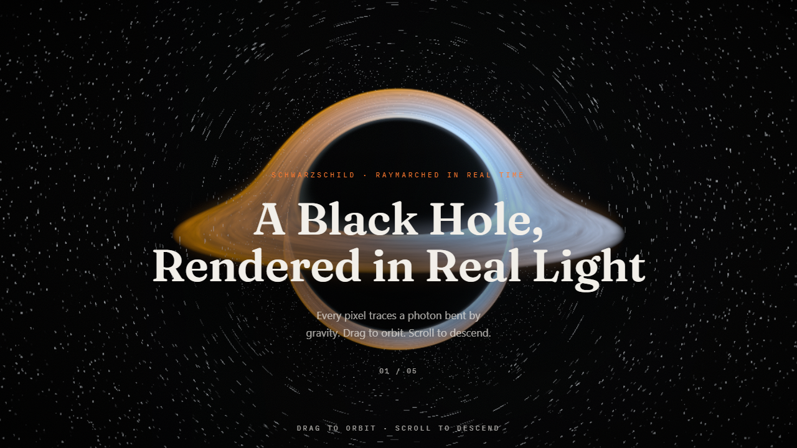

# Gargantua — A Real-Time Black Hole, Rendered in Real Light

A frontend-only, physics-accurate **black hole simulation** built with **React, TypeScript, and a custom GLSL raymarcher**. A Schwarzschild black hole is rendered photon by photon in a single fragment shader: light bends around the event horizon under **gravitational lensing**, a turbulent **accretion disk** burns blue-white on its approaching side and dims to ember-orange on the receding one through **relativistic Doppler beaming**, and a scroll-driven camera flight carries you from a wide establishing shot down toward the photon sphere — all wrapped in an editorial narrative about what you're seeing.

> No 3D meshes. No textures. Every frame is the output of a ray-marched spacetime integral running on the GPU.





## Features

- 🕳️ **Accurate gravitational lensing** — the Einstein ring, the photon ring, and the disk's far side bent up and over the shadow (the "Interstellar / Gargantua" look)
- 🔵🟠 **Relativistic Doppler split** — physically-correct brightness *and* color asymmetry, not an art filter
- 🌫️ **Turbulent accretion disk** — fbm noise filaments sheared by differential (Keplerian) rotation, with vertical atmosphere glow and a white-hot inner edge
- ✨ **HDR bloom** post-processing tuned so the disk glows while the shadow stays pure black
- 🎥 **Scroll = guided camera flight** through five narrative sections, with free drag-to-orbit at any time
- ⚡ **Adaptive quality** — device-aware resolution scaling and march-step budget, plus an offscreen render pause
- 🧪 **Tested core logic** — Vitest unit tests on the store, camera path, uniform builder, and quality detection

## The physics

The shader integrates photon paths through a **Schwarzschild geodesic approximation**: at each ray-march step the direction is deflected by

```
a = -1.5 · h² · r̂ / r⁴
```

where `h` is the conserved angular momentum of the ray. This single term reproduces gravitational lensing, the photon ring, and capture at the event horizon. The **accretion disk** orbits at Keplerian speed (`v ∝ r^-1/2`); its emission is scaled by the `D³` relativistic beaming factor from the line-of-sight velocity, producing the characteristic bright/dim asymmetry, and its color is shifted blue (approaching) or red (receding). HDR output is tone-mapped with a **luminance-preserving Reinhard** curve so the disk's hue survives its own brightness.

This is a real-time *approximation* tuned for beauty and interactivity — not a research-grade Kerr ray tracer. A non-rotating (Schwarzschild) metric with Doppler beaming captures the iconic look without the cost of a full rotating-metric integration.

## Tech stack

| Concern | Choice |
| --- | --- |
| Framework | React 19 + TypeScript (strict) |
| Build / dev | Vite |
| 3D / GPU | [react-three-fiber](https://github.com/pmndrs/react-three-fiber) + three.js, fullscreen shader quad |
| Black hole | Custom GLSL fragment shader (ray-marched) |
| Post-processing | @react-three/postprocessing (bloom) |
| Animation | Framer Motion |
| State | Zustand (the single UI ↔ shader contract) |
| Styling | Tailwind CSS v4 |
| Tests | Vitest |

## Getting started

Requires Node 20+.

```bash
npm install
npm run dev      # start the dev server (http://localhost:5173)
npm run build    # type-check + production build
npm run preview  # serve the production build
npm test         # run the unit tests
npm run lint     # lint
```

## Controls

**Drag to orbit · scroll to descend.** Scrolling flies the camera along a tuned keyframe path through the narrative; grabbing the scene lets you orbit freely, then it eases back to the path on release.

## Project structure

```
src/
  scene/
    BlackHoleCanvas.tsx      # <Canvas>, camera, OrbitControls, bloom, quality tiers
    BlackHole.tsx            # fullscreen quad; feeds per-frame uniforms
    ScrollCameraRig.tsx      # eases the camera along the scroll path
    cameraPath.ts            # scroll-progress → camera keyframe interpolation
    useBlackHoleUniforms.ts  # builds the uniform object from presets
    shaders/
      blackhole.frag.glsl    # the raymarcher: lensing, disk, Doppler, bloom-ready HDR
      blackhole.vert.glsl    # fullscreen passthrough
  sections/                  # the five scroll-narrative sections + copy
  ui/                        # scroll progress bar, interaction hint
  store/useSimStore.ts       # scroll / camera / quality state
  lib/
    presets.ts               # all tuned physics + art-direction constants
    detectQuality.ts         # device-capability → quality tier
```

All of the tunable physics and art-direction values live in [`src/lib/presets.ts`](src/lib/presets.ts) — start there if you want to retune the look.

## Keywords

Black hole simulation · gravitational lensing · accretion disk · relativistic Doppler beaming · Schwarzschild metric · ray marching · GLSL shader · WebGL · Three.js · react-three-fiber · React · TypeScript · Interstellar · Gargantua · real-time rendering · generative space visualization.

## License

MIT — see [`LICENSE`](LICENSE).

---

Designed and built by **[Alvalen Shafel](mailto:alvalen.shafel04@gmail.com)**.
